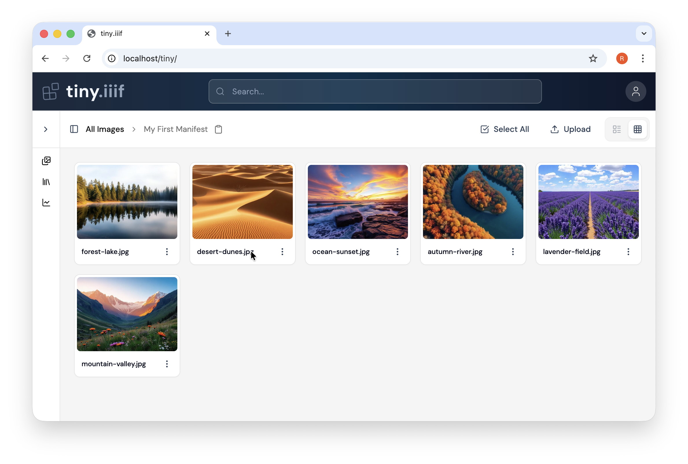

# tiny.iiif

Publish your images as [IIIF](https://iiif.io/) in a minute - or less!



## Overview

**tiny.iiif** is a minimal IIIF server. It fills the gap between running a full collection management system, and hand-editing your own Presentation manifest files.

## Features
- **Drag & drop images** → instant IIIF Image Service (version 2 and 3) powered by [Cantaloupe](https://cantaloupe-project.github.io/).
- **Create a folder, add images** → instant IIIF Presentation v3 manifest
- **Zero configuration** → works out of the box with sensible defaults
- **User-friendly admin interface** → simple, modern, easy to use
- **Production-ready** → Docker-based deployment with [NGINX](https://nginx.org/) as reverse proxy

## Prerequisites

- Docker 24.0+
- Docker Compose 2.x

## Quick Start

1. **Create your environment file**

   ```sh
   cp .env.example .env
   ```

2. **Configure authentication**
   Edit `.env` to change your username and password for the admin GUI. (Default credentials are `tiny` / `tiny`.)

3. **Launch tiny.iiif**

   ```sh 
   docker compose up --build
   ```

4. **Access services**
   - Admin GUI: <http://localhost/tiny>
   - IIIF Image API: <http://localhost/iiif>
   - Manifests: <http://localhost/manifests>

## Usage

Once **tiny.iiif** is running:

1. Open the admin GUI at <http://localhost/tiny>
2. Log in with your credentials (default: `tiny` / `tiny`)
3. Drag and drop images to publish them via Cantaloupe
4. Create folders and add images to publish IIIF Presentation manifests

## Development

This repository includes a separate Docker setup for frontend development.

In development mode:
- Cantaloupe and NGINX run in Docker
- The admin GUI runs locally with live reload

### Additional Prerequisites

- NodeJS 20+
- npm 11+

### Start Development Backend

1. **Start the backend**

   ```sh 
   docker compose -f ./docker-compose.dev.yml up --build
   ```

2. **Install frontend dependencies**

   ```sh
   cd tiny
   npm install
   ```

3. **Start development server**
  
   ```sh
   npm start
   ```

4. **Access the admin GUI** at <http://localhost:4321>

## License

[MIT](LICENSE)

## Managed Hosting

If you would like to use **tiny.iiif** but don't want to set up and maintain your own server, I can host it for you. You'll get your own private tiny.iiif instance at a custom address:

```
https://your-name.tiny-iiif.org
```

Managed hosting is available for a modest fee, which directly supports the continued development of the project.

If this sounds useful, [drop me a short email](mailto:hello@rainersimon.io) and I'll put together an offer that fits your needs.

---

**Status:** Work in progress. Contributions and feedback welcome!


